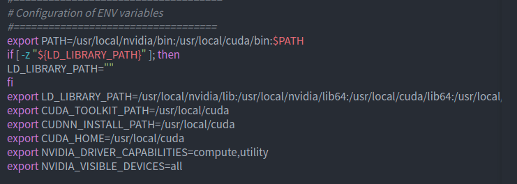

# 为什么需要量化和压缩?

一般来说部署在云端的模型参数量、计算量、内存占用都非常的庞大，但由于它跑在服务器上，这些资源对于它而言还算是充足。但是在移动平台、嵌入式平台、甚至MCU上呢？似乎就很难部署上这种资源消耗巨大的模型，此时便是模型量化和压缩等一系列技术上场的时候了。

事实上，我更愿意把模型压缩看成量化、剪枝等一系列技术的目的，而不是一个特定的技术点。模型量化中将浮点计算转换成低比特定点计算带给我得最直观的感受是模型文件的体积减少得特别多（个人观点）。

## 为什么我选用了AIMET？
这个主要还是由于需要部署的模型的推理框架是SNPE呀！而AIMET正是高通创新中心推出的针对自家硬件和推理框架的模型量化和压缩工具，所以如果你也需要将模型部署到高通的硬件平台，并且获得一个较为良好的效果，建议你也使用这样的方式AIMET（量化压缩）+ SNPE（模型推理）（或者，如果你明确知道其它的推理框架使用了硬件厂商提供的硬件加速库的话，在推理速度上应当也是无大影响的）。之所以有这样的建议，是看到了一篇文章中有提到模型量化和硬件间的关系，来自于[AI 框架部署方案之模型量化概述--量化的落地问题](https://zhuanlan.zhihu.com/p/354921065 "")。我也预想过不同硬件平台可能会导致模型量化的方式有所不同，但目前，除此之外，没有找到更多的佐证，也就没有与之相关的数据作支撑了。先在此引用作参考，后续拓宽验证后补上吧！


## 初见AIMET
姓名：AIEMT ---->  AI Model Efficiency Toolkit(全称：模型优化工具包)<br>
年龄：2019夏至今<br>
技能：**针对PyTorch和TensorFlow模型**的一系列**模型量化和压缩**能力，且具有良好的**可视化**能力<br>
成长经历：详细信息见[aimet-pages](https://github.com/quic/aimet-pages "")
|  版本  |  描述  |
| ---- | ---- |
|  1.13.0   |   支持GPU，ubuntu [**18.04及以上**]上使用docker需要下载[nvidia-docker](https://github.com/NVIDIA/nvidia-docker "")。     |
|  1.14.0   |        |
|  1.16.0   |   注意:此版本存在已知的安装和依赖关系问题。请不要使用此版本。相反，请使用1.16.1或更高版本。     |
|  1.16.1   |   1. 为 CPU 和 GPU 模型添加了单独的包。  这允许仅使用 CPU 主机的用户运行 AIMET。<br>2. 为 PyTorch 和 TensorFlow 添加了单独的包。  减少用户需要安装的依赖项数量。     |
|   1.16.1.py37        |      适用于 Python 3.7 环境 ；功能等同于1.16.1，但未经过严格测试，它的创建只是为了与 Google Colab 兼容。     |
|  1.16.2   |   适用于Python 3.6 环境1. 添加了一个新的训练后量化功能，称为 AdaRound，代表 AdaptiveRounding。<br> 2. 量化模拟和 QAT支持循环层（RNN、LSTM、GRU）。     |
|  1.17.0   |   1. 添加 Adaround TF 功能。 <br> 2. 添加Torch 量化、通道修剪和空间 SVD 压缩的示例。     |


```
注意：1.16.1版本以后各版本均带.py37发行包，用于与Google Colab兼容，两者功能相同。目前为止，未标明为.py37的包，仍旧需要Python3.6的环境。
```

## 准备AIMET
### 下载AIMET包
你可以在[高通github仓库](https://github.com/quic/aimet/releases "")中找到目前已经发行过的所有版本。官方推荐的是使用docker或者Google Colab安装，但是由于我隔离python时使用更多的是Anaconda，所以我们将以conda环境来开始我们的安装，安装的过程可能会有一些问题，我会做好注明的。

|   环境(顺序往下)   |   版本   |
| ---- | ---- |
|      ubuntu           |        18.04 LTS             |
|   conda  |   4.10.3    |
|      pytorch            |      1.7.1+cpu              |
|       torchvision    |       0.8.2+cpu                 |
|   AIMET        |       1.16.2.py37          |

**1. 关于Ubuntu的版本**
我在[高通AIMET论坛](https://forums.quicinc.com/ "") 问过这个问题，得到的回答是明确最低版本就是18.04。这里只是想让你知道，如果你在使用AIMET的过程中遇到问题的话，去官方的论坛是个不错的选择。

**安装conda**
我使用conda==4.10.3版本已经有一段时间了，而我也没有尝试使用其它版本的conda来安装AIMET，希望其它版本不会出现其它莫名奇妙的问题。

关于conda的安装和使用，网上已经有很多现成的资源了，只要你在网络上搜索一下，你就能得到你想要的答案。**需要注意的可能就是更换下载源以及AIMET所需的python版本**，这样你在**创建conda 环境**`conda -n env_name python=3.7`的时候大概率不会有下载包报错的问题,，这依旧是现成的，所以我们继续往下。


>这里有必要将两个较为重要的环境变量进行说明（如果你按照官方手册上的命令安装）
>> $AIMET_VARIANT<br>
>> 这个变量是为了区分硬件资源和你需要的模型框架（前面说了支持Pytorch和Tensorflow）<br>
>> 所以分别有两个可选的值：<br>
>>
>>> Pytorch : [torch-gpu | torch-cpu ]<br>
>>> Tensorflow: [tf-gpu | tf-cpu ]<br>
>>
>> $release_tag<br>
>> 显然这是用来，选择aimet的发行版本的，比如：1.17.0、1.16.2.py37等 <br>
>> 另外，你需要用以下这个值去替换命令行中的*py3-none-any*字段<br>
>>> py3-none-any: [cp36-cp36m-linux_x86_64 | cp37-cp37m-linux_x86_64]<br>

**2. AIMET**
我开始使用AIMET时，高通已经发行了*1.16.2.py37*版本，所以我设置**export release_tag=1.16.2.py37**，到这里，你可直接按照官网命令使用**pip install**命令安装AIMET了，不管你使用的在线或离线安装。

我是从Pytorch开始入门模型训练的，所以，我使用了Pytroch模型训练框架；又由于，没有GPU硬件资源，所以，我下载了Pytorch的CPU版本，设置与之对应的临时环境变量 **export AIMET_VARIANT=torch-cpu**，当然你**也可以在~/.bashrc中把它添加为用户环境变量**。

```
按照官方的在线安装方式，你需要执行如下命令：
$ export AIMET_VARIANT=torch-cpu
$ export release_tag=1.16.2.py37
# 然后，替换py3-none-any字段为py3-none-any，便可如下执行命令：
$ python3 --m pip install https://github.com/quic/aimet/releases/download/${release_tag}/Aimet-${AIMET_VARIANT}_${release_tag}-cp37-cp37m-linux_x86_64.whl
===============================================================
如果你下载了AIMET离线包的话，直接安装就行：
$ python3 --m pip install package_name

```

这里或许你会有些感到奇怪，*.py37*不是用来兼容Google Colab的？？Conda中能正常使用？？是的，这种安装方式确实有点不符合官方描述，但是到目前为止，只要你做完后续的步骤，它仍能够顺利的使用。虽然我没有去测试所有的API接口，但是使用python能够顺利的导入你所需的包。

**3. conda环境中装pytorch**
说明以上两个变量不仅仅只是为了让你选择合适的AIMET版本，同时也想让你知道需要根据自己的硬件资源和针对的模型框架选择一个合适Pytorch或者Tensorflow版本。

前面，你已经安装了conda，所以，应当能够自如的安装Pytorch/Tensorflow了，仍旧是直接`pyhon3 -m pip install xxx`就行。

现在，我们来安装Pytorch/Tensorflow和一些依赖包。如果你安装在主机上，你会在类似以下的路径中找到一些txt文件：
```
主机路径：
/usr/local/lib/python3.6/dist-packages/aimet_common/bin/reqs_deb_common.txt
/usr/local/lib/python3.6/dist-packages/aimet_torch/bin/reqs_deb_torch_gpu.txt 

Conda环境路径：
/home/username/....../anaconda3/envs/env_name(你的conda环境的名字)/lib/python3.7(与Python的版本对应)/site-packages/aimet_torch(由你选择的训练框架决定)/bin/
/home/username/....../anaconda3/envs/env_name(你的conda环境的名字)/lib/python3.7(与Python的版本对应)/site-packages/aimet_common(似乎都有)/bin/

注意：以上的路径中，均提供了deb安装（针对主机apt-get）和pip安装的txt文件
```

**4. 一些额外的配置**
**替换Pillow包（可选，非强制）**
```
python3 -m pip uninstall -y pillow
python3 -m pip install --no-cache-dir Pillow-SIMD==6.0.0.post0
```

**GPU安装(如果有的话)**

事实上，由于我没有GPU资源，所以并没有做以下的步骤，准备安装GPU包的环境如下（来源于[AIMET github](https://github.com/quic/aimet/blob/develop/packaging/install.md "")）：

注意：请访问此页面以获取适用于您的环境的准确和最新的安装说明。
```
$ wget https://developer.download.nvidia.com/compute/cuda/repos/ubuntu1804/x86_64/cuda-ubuntu1804.pin
$ mv cuda-ubuntu1804.pin /etc/apt/preferences.d/cuda-repository-pin-600
$ wget https://developer.download.nvidia.com/compute/cuda/11.1.0/local_installers/cuda-repo-ubuntu1804-11-1-local_11.1.0-455.23.05-1_amd64.deb
$ dpkg -i cuda-repo-ubuntu1804-11-1-local_11.1.0-455.23.05-1_amd64.deb
$ apt-key add /var/cuda-repo-ubuntu1804-11-1-local/7fa2af80.pub
$ apt-get update
$ apt-get -y install cuda

$ wget http://developer.download.nvidia.com/compute/machine-learning/repos/ubuntu1804/x86_64/nvidia-machine-learning-repo-ubuntu1804_1.0.0-1_amd64.deb
$ apt-get --assume-yes install ./nvidia-machine-learning-repo-ubuntu1804_1.0.0-1_amd64.deb
$ apt-get update

$ ln -s /usr/lib/x86_64-linux-gnu/libjpeg.so /usr/lib

# If you installed the CUDA 10.x drivers
$ ln -s /usr/local/cuda-10.0 /usr/local/cuda
# OR if you installed the CUDA 11.x drivers
$ ln -s /usr/local/cuda-11.0 /usr/local/cuda
```

**初始化环境并设置必要变量**
```
主机：
    source /usr/local/lib/python3.6/dist-packages/aimet_common/bin/envsetup.sh
conda：
    source /home/username/....../anaconda3/envs/env_name(你的conda环境的名字)/lib/python3.7(与Python的版本对应)/site-packages/aimet_common/bin/envsetup.sh
```
这个文件里面，也是在设置一些环境变量，内容如下：
<div align=center>

</div>

除此之外，你还需要设置AIMET包路径的环境变量：
```
主机：
export LD_LIBRARY_PATH=/usr/local/lib/python3.6/dist-packages/aimet_common/x86_64-linux-gnu:/usr/local/lib/python3.6/dist-packages/aimet_common:$LD_LIBRARY_PATH

if [[ $PYTHONPATH = "" ]]; then
    export PYTHONPATH=/usr/local/lib/python3.6/dist-packages/aimet_common/x86_64-linux-gnu; 
else 
    export PYTHONPATH=/usr/local/lib/python3.6/dist-packages/aimet_common/x86_64-linux-gnu:$PYTHONPATH; 
fi

conda：
# AIMET CONFIG
export LD_LIBRARY_PATH="/home/user_name/.../anaconda3/envs/env_name/lib/python3.7/site-packages/aimet_common/x86_64-linux-gnu:$LD_LIBRARY_PATH"
if [[ $PYTHONPATH = "" ]]; then 
    export PYTHONPATH="/home/user_name/.../anaconda3/envs/env_name/lib/python3.7/site-packages/aimet_common/x86_64-linux-gnu;"
else 
    export PYTHONPATH="/home/user_name/.../anaconda3/envs/env_name/lib/python3.7/site-packages/aimet_common/x86_64-linux-gnu:$PYTHONPATH"
fi
```

这两个环境变量是极其重要的，请务必*保证路径指向正确*，否则，你会出现找不到*libpymo依赖包*的问题。

进入python交互界面后，导入以下这些库，没报错的话，你就可以开始使用AIMET进行量化和压缩了。

```
import torch
from torchvision import models

import aimet_common
from aimet_torch.quantsim import QuantizationSimModel
```

如果，你想了解更多关于AIMET的详细信息，你可以直接访问高通开发者网络提供的链接：
https://developer.qualcomm.com/software/ai-model-efficiency-toolkit/key-resources

## 开始AIMET
到此，你已经准备好了AIMET的运行环境，为了快速开始上手使用，建议优先查看一下官方API接口描述：
https://quic.github.io/aimet-pages/releases/1.16.2.py37/user_guide/index.html
如果你和我一样，在这之前并没有接触过模型量化和压缩技术，你在看文档的时候或许会一头雾水，但不用着急，可以先记下这些概念而不必去深入了解内部原理，等熟悉了这些接口的使用再尝试深入了解他们。