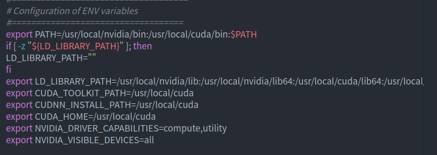

## Why do we need quantization and compression?

Generally speaking, the amount of model parameters, calculations, and memory occupied in the cloud are very large, but because it runs on the server, these resources are still sufficient for it. But what about on mobile platforms, embedded platforms, and even MCUs? It seems that it is difficult to deploy such a resource-intensive model, and it is time for a series of technologies such as model quantization and compression to come into play.

In fact, I prefer to regard model compression as the purpose of a series of technologies such as quantization and pruning, rather than a specific technical point. In model quantification, converting floating point calculations into low-ratio specific point calculations gave me the most intuitive feeling that the volume of the model file has been reduced a lot (personal opinion). 

## Why did I choose AIMET?
This is mainly because the reasoning framework of the model that needs to be deployed is SNPE! AIMET is a model quantification and compression tool for its own hardware and reasoning framework launched by Qualcomm Innovation Center. Therefore, if you also need to deploy the model to Qualcomm's hardware platform and obtain a relatively good effect, it is recommended that you also use this Method AIMET (quantized compression) + SNPE (model inference) (or if you know that other inference frameworks use hardware acceleration libraries provided by hardware manufacturers, there should be no significant impact on the inference speed). The reason for this suggestion is that I saw an article mentioning the relationship between model quantification and hardware. It comes from [Model Quantification Overview of AI Framework Deployment Plan-Quantitative Landing Problem] (https://zhuanlan. zhihu.com/p/354921065 ""). I also expected that different hardware platforms may lead to different ways of quantifying the model, but at present, in addition to this, no more corroboration has been found, and there is no relevant data to support it. Cite it here for reference first, and add it after broadening the verification later! 

## First meet AIMET
Name: AIEMT ----> AI Model Efficiency Toolkit (full name: Model Optimization Toolkit)<br>
Age: Summer 2019 to present<br>
Skills: **A series of **model quantization and compression** capabilities for PyTorch and TensorFlow models**, and good **visualization** capabilities<br>
Growth experience: see for details 

| Version | Description |
| ---- | ---- |
| 1.13.0 | Support GPU, docker on ubuntu [**18.04 and above**] needs to download [nvidia-docker](https://github.com/NVIDIA/nvidia-docker ""). |
| 1.14.0 | |
| 1.16.0 | Note: This version has known installation and dependency issues. Please do not use this version. Instead, please use version 1.16.1 or higher. |
| 1.16.1 | 1. Added separate packages for CPU and GPU models. This allows users who only use the CPU host to run AIMET. <br>2. Added separate packages for PyTorch and TensorFlow. Reduce the number of dependencies that users need to install. |
| 1.16.1.py37 | Applicable to Python 3.7 environment; the function is equivalent to 1.16.1, but it has not been rigorously tested. It was created only to be compatible with Google Colab. |
| 1.16.2 | Applicable to Python 3.6 environment 1. Added a new post-training quantization function called AdaRound, which stands for AdaptiveRounding. <br> 2. Quantitative simulation and QAT support loop layers (RNN, LSTM, GRU). |
| 1.17.0 | 1. Add Adaround TF function. <br> 2. Add examples of Torch quantization, channel trimming, and spatial SVD compression. | 

```
Note: After version 1.16.1, each version comes with a .py37 release package for compatibility with Google Colab, and the functions of the two are the same. So far, packages that are not marked as .py37 still require a Python 3.6 environment.
``` 

## Prepare AIMET
### Download AIMET package
You can find all the versions that have been released so far in [Qualcomm github repository](https://github.com/quic/aimet/releases ""). The official recommendation is to use docker or Google Colab to install, but because I use Anaconda more when isolating python, we will start our installation in the conda environment. There may be some problems in the installation process, and I will make a note Clear. 

| Environment (downward order) | Version |
| ---- | ---- |
| ubuntu | 18.04 LTS |
| conda | 4.10.3 |
| pytorch | 1.7.1+cpu |
| torchvision | 0.8.2+cpu |
| AIMET | 1.16.2.py37 | 

**1. About Ubuntu version**
I asked this question in [Qualcomm AIMET Forum](https://forums.quicinc.com/ ""), and the answer was that the minimum version is 18.04. I just want you to know that if you encounter problems while using AIMET, it is a good choice to go to the official forum. 

**Install conda**
I have been using conda==4.10.3 version for some time, and I have not tried to use other versions of conda to install AIMET, I hope that other versions will not have other inexplicable problems.

Regarding the installation and use of conda, there are already many ready-made resources on the Internet, as long as you search on the Internet, you can get the answer you want. **What needs attention may be to change the download source and the python version required by AIMET**, so that when you **create a conda environment**`conda -n env_name python=3.7`, there is a high probability that there will be no download package error The question, this is still readily available, so we continue on. 

>It is necessary to explain the two more important environment variables (if you install according to the commands in the official manual)
>> $AIMET_VARIANT<br>
>> This variable is to distinguish between hardware resources and the model framework you need (I mentioned earlier that it supports Pytorch and Tensorflow)<br>
>> So there are two optional values:<br>
>>
>>> Pytorch: [torch-gpu | torch-cpu ]<br>
>>> Tensorflow: [tf-gpu | tf-cpu ]<br>
>>
>> $release_tag<br>
>> Obviously this is used to select the release version of aimet, such as: 1.17.0, 1.16.2.py37, etc. <br>
>> In addition, you need to replace the *py3-none-any* field in the command line with the following value<br>
>>> py3-none-any: [cp36-cp36m-linux_x86_64 | cp37-cp37m-linux_x86_64]<br> 

**2. AIMET**
When I started to use AIMET, Qualcomm had already released the *1.16.2.py37* version, so I set **export release_tag=1.16.2.py37**, here, you can directly follow the official website command to use **pip install* *Command to install AIMET, regardless of the online or offline installation you use.

I started the introductory model training from Pytorch, so I used the Pytroch model training framework; because there is no GPU hardware resources, I downloaded the CPU version of Pytorch and set the corresponding temporary environment variable **export AIMET_VARIANT =torch-cpu**, of course you can also add it as a user environment variable in ~/.bashrc**. 

```
According to the official online installation method, you need to execute the following commands:
$ export AIMET_VARIANT=torch-cpu
$ export release_tag=1.16.2.py37
# Then, replace the py3-none-any field with py3-none-any, you can execute the command as follows:
$ python3 --m pip install https://github.com/quic/aimet/releases/download/${release_tag}/Aimet-${AIMET_VARIANT}_${release_tag}-cp37-cp37m-linux_x86_64.whl
================================================== =============
If you have downloaded the AIMET offline package, just install it directly:
$ python3 --m pip install package_name

``` 

You may be a little surprised here, *.py37* is not compatible with Google Colab? ? Can it be used normally in Conda? ? Yes, this installation method does not conform to the official description, but so far, as long as you complete the subsequent steps, it can still be used smoothly. Although I did not test all the API interfaces, using python can smoothly import the packages you need. 

**3. Install pytorch in conda environment**
Explain that the above two variables are not only to let you choose the appropriate AIMET version, but also to let you know that you need to choose a suitable Pytorch or Tensorflow version according to your hardware resources and the targeted model framework.

Earlier, you have already installed conda, so you should be able to install Pytorch/Tensorflow freely, just use `pyhon3 -m pip install xxx` directly.

Now, let's install Pytorch/Tensorflow and some dependency packages. If you install it on the host, you will find some txt files in a path similar to the following: 

```
Host path:
/usr/local/lib/python3.6/dist-packages/aimet_common/bin/reqs_deb_common.txt
/usr/local/lib/python3.6/dist-packages/aimet_torch/bin/reqs_deb_torch_gpu.txt

Conda environment path:
/home/username/....../anaconda3/envs/env_name (the name of your conda environment)/lib/python3.7 (corresponding to the version of Python)/site-packages/aimet_torch (training by your choice) Frame decision)/bin/
/home/username/....../anaconda3/envs/env_name (the name of your conda environment)/lib/python3.7 (corresponding to the Python version)/site-packages/aimet_common (seems to have both)/ bin/

Note: In the above paths, txt files for deb installation (for host apt-get) and pip installation are provided
``` 

**4. Some additional configuration**
**Replace Pillow package (optional, not mandatory)** 
```
python3 -m pip uninstall -y pillow
python3 -m pip install --no-cache-dir Pillow-SIMD==6.0.0.post0
```

**GPU installation (if any)**

In fact, because I don’t have GPU resources, I didn’t do the following steps. The environment for installing GPU packages is as follows (from [AIMET github](https://github.com/quic/aimet/blob/develop/packaging/ install.md "")):

Note: Please visit this page for accurate and up-to-date installation instructions for your environment. 

```
$ wget https://developer.download.nvidia.com/compute/cuda/repos/ubuntu1804/x86_64/cuda-ubuntu1804.pin
$ mv cuda-ubuntu1804.pin /etc/apt/preferences.d/cuda-repository-pin-600
$ wget https://developer.download.nvidia.com/compute/cuda/11.1.0/local_installers/cuda-repo-ubuntu1804-11-1-local_11.1.0-455.23.05-1_amd64.deb
$ dpkg -i cuda-repo-ubuntu1804-11-1-local_11.1.0-455.23.05-1_amd64.deb
$ apt-key add /var/cuda-repo-ubuntu1804-11-1-local/7fa2af80.pub
$ apt-get update
$ apt-get -y install cuda

$ wget http://developer.download.nvidia.com/compute/machine-learning/repos/ubuntu1804/x86_64/nvidia-machine-learning-repo-ubuntu1804_1.0.0-1_amd64.deb
$ apt-get --assume-yes install ./nvidia-machine-learning-repo-ubuntu1804_1.0.0-1_amd64.deb
$ apt-get update

$ ln -s /usr/lib/x86_64-linux-gnu/libjpeg.so /usr/lib

# If you installed the CUDA 10.x drivers
$ ln -s /usr/local/cuda-10.0 /usr/local/cuda
# OR if you installed the CUDA 11.x drivers
$ ln -s /usr/local/cuda-11.0 /usr/local/cuda
```

**Initialize the environment and set the necessary variables**
```
Host:
     source /usr/local/lib/python3.6/dist-packages/aimet_common/bin/envsetup.sh
conda:
     source /home/username/....../anaconda3/envs/env_name (the name of your conda environment)/lib/python3.7 (corresponding to the Python version)/site-packages/aimet_common/bin/envsetup. sh
```
In this file, some environment variables are also being set, and the contents are as follows: 

<div align=center>

</div>

In addition, you also need to set the environment variable of the AIMET package path: 

```
Host：
export LD_LIBRARY_PATH=/usr/local/lib/python3.6/dist-packages/aimet_common/x86_64-linux-gnu:/usr/local/lib/python3.6/dist-packages/aimet_common:$LD_LIBRARY_PATH

if [[ $PYTHONPATH = "" ]]; then
    export PYTHONPATH=/usr/local/lib/python3.6/dist-packages/aimet_common/x86_64-linux-gnu; 
else 
    export PYTHONPATH=/usr/local/lib/python3.6/dist-packages/aimet_common/x86_64-linux-gnu:$PYTHONPATH; 
fi

conda：
# AIMET CONFIG
export LD_LIBRARY_PATH="/home/user_name/.../anaconda3/envs/env_name/lib/python3.7/site-packages/aimet_common/x86_64-linux-gnu:$LD_LIBRARY_PATH"
if [[ $PYTHONPATH = "" ]]; then 
    export PYTHONPATH="/home/user_name/.../anaconda3/envs/env_name/lib/python3.7/site-packages/aimet_common/x86_64-linux-gnu;"
else 
    export PYTHONPATH="/home/user_name/.../anaconda3/envs/env_name/lib/python3.7/site-packages/aimet_common/x86_64-linux-gnu:$PYTHONPATH"
fi
```

These two environment variables are extremely important. Please make sure that the path points to the correct path. Otherwise, you will have the problem of not being able to find the *libpymo dependency package*.

After entering the python interactive interface, import the following libraries, if no errors are reported, you can start using AIMET for quantization and compression. 

```
import torch
from torchvision import models

import aimet_common
from aimet_torch.quantsim import QuantizationSimModel
```

If you want to know more detailed information about AIMET, you can directly visit the link provided by Qualcomm Developer Network: 
https://developer.qualcomm.com/software/ai-model-efficiency-toolkit/key-resources

## Start AIMET
At this point, you have prepared the AIMET operating environment. In order to get started quickly, it is recommended to check the official API interface description first: 
https://quic.github.io/aimet-pages/releases/1.16.2.py37/user_guide/index.html

If you are like me and have not been exposed to model quantization and compression technology before, you may be confused when you read the document, but don’t worry, you can write down these concepts first without having to understand the internal principles, etc. Get familiar with the use of these interfaces before trying to understand them in depth. 
